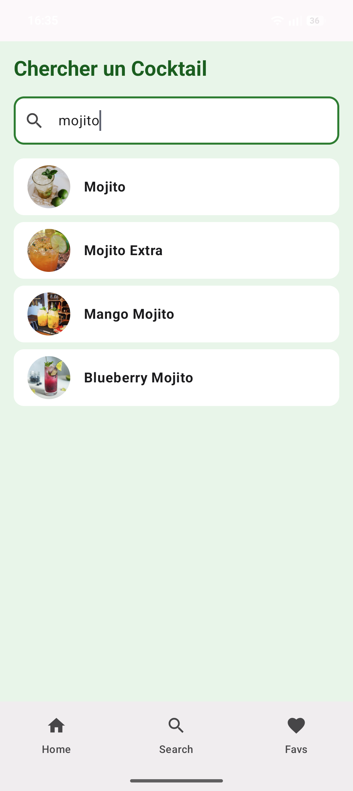
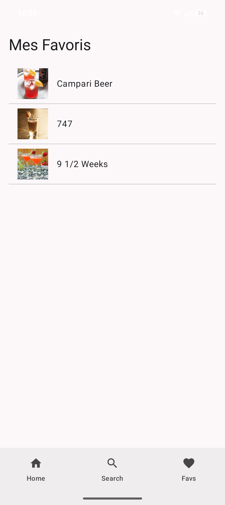
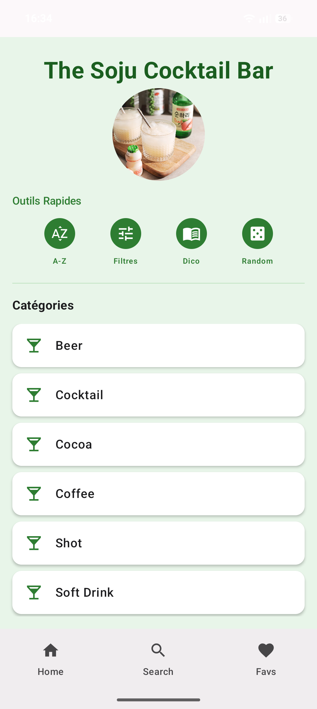

# CocktailApp 🍹

Une application Android intuitive pour découvrir des cocktails et garder sous la main ceux que vous préférez. 

## 🚀 Fonctionnalités
- **Exploration :** Parcourez une liste complète de cocktails.
- **Favoris :** Ajoutez ou retirez des cocktails de votre "Like List" en un clic.
- **Persistance :** Vos favoris sont enregistrés localement, même après la fermeture de l'application.

## 🛠 Stack Technique
- **Langage :** Kotlin
- **Architecture :** MVVM (Model-View-ViewModel)
- **Persistance :** API Database
- **Networking :** Retrofit (API : TheCocktailDB)
- **Asynchronisme :** Kotlin Coroutines

## 📸 Aperçu

## 📦 Installation
1. Clonez ce repository : `git clone https://github.com/CamilleMartini/TheGreatestCocktailApp.git`
2. Ouvrez le projet dans **Android Studio**.
3. Assurez-vous d'avoir configuré votre clé API si nécessaire (voir `local.properties`).
4. Lancez l'application sur un simulateur ou un appareil Android.

## 💡 Prochaines étapes (Roadmap)
- [x] Ajouter une recherche par ingrédient.
- [x] Ajouter un système de filtre par catégorie (alcoolisé/non-alcoolisé).
- [ ] Mettre en place un mode sombre.

## 🤝 Contribution
Les contributions sont les bienvenues ! N'hésitez pas à ouvrir une "Issue" ou à proposer une "Pull Request".

---
*Développé avec passion en Kotlin.*
